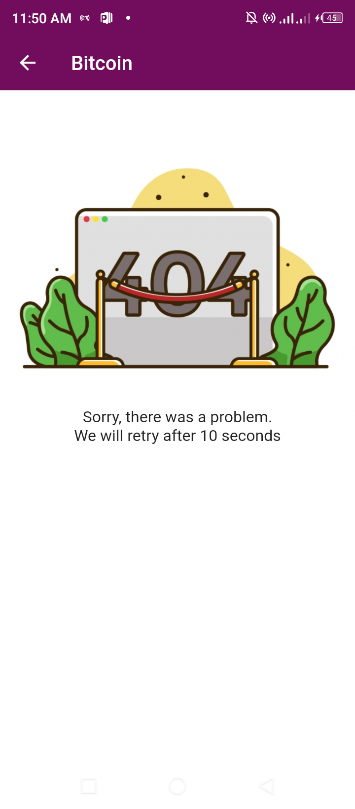

# ejaratest

## Feature Screenshot

  
  
  
  
  

<video src='https://user-images.githubusercontent.com/36260221/147098619-51c4388d-7408-4c2b-81fb-4b8daf3cdd4c.mp4' width=200/>

## Flutter init
This project is a starting point for a Flutter application.

A few resources to get you started if this is your first Flutter project:

- [Lab: Write your first Flutter app](https://flutter.dev/docs/get-started/codelab)
- [Cookbook: Useful Flutter samples](https://flutter.dev/docs/cookbook)

For help getting started with Flutter, view our
[online documentation](https://flutter.dev/docs), which offers tutorials,
samples, guidance on mobile development, and a full API reference.
